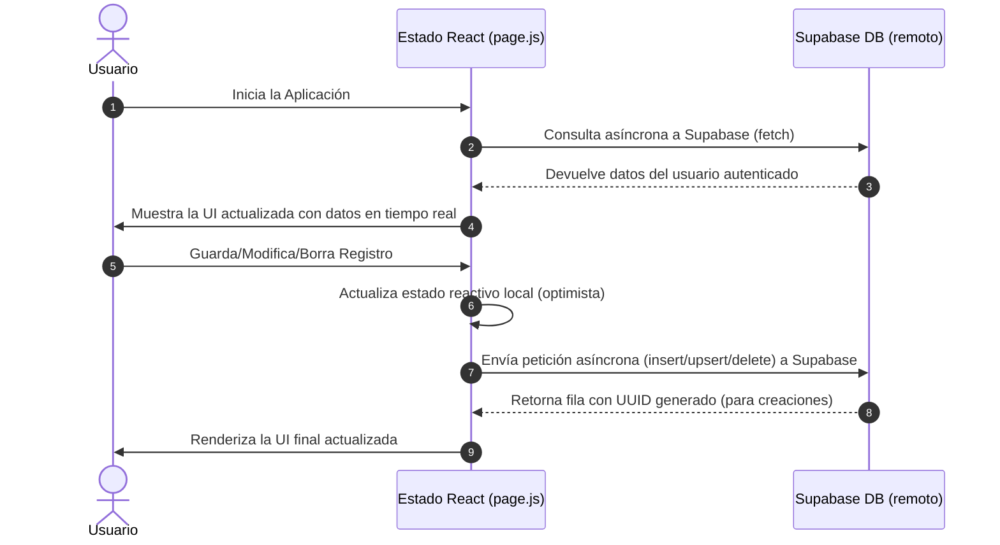

# 📊 ServiTrack — Gestión Inteligente de Servicios y Gastos

[](https://gestion-de-servicios-omega.vercel.app/)
[](https://nextjs.org/)
[](https://react.dev/)
[](https://supabase.com/)
[](https://tailwindcss.com/)
[](https://jestjs.io/)

**ServiTrack** es una aplicación web del tipo **Single Page Application (SPA)** diseñada para la gestión, organización y análisis en tiempo real de gastos, ingresos y servicios del hogar. Construida con tecnologías modernas y siguiendo las mejores prácticas de desarrollo y seguridad.

---

## 🚀 Demo En Vivo

Puedes ver y probar la aplicación en producción haciendo clic en el siguiente enlace:

👉 **[Ver ServiTrack en Vivo (Vercel)](https://gestion-de-servicios-omega.vercel.app/)** 👈

---

## ✨ Características Principales

- 🔒 **Autenticación Segura y Aislamiento:** Inicio de sesión, registro y recuperación de contraseñas mediante **Supabase Auth** con seguridad a nivel de filas (**RLS**) activa en base de datos.
- ⚡ **Datos en Tiempo Real:** Flujo continuo de sincronización entre el estado reactivo de la aplicación y la base de datos PostgreSQL en Supabase, libre de almacenamiento local (`localStorage`) para evitar vulnerabilidades XSS.
- 📊 **Dashboard Completo:** Visualización intuitiva de métricas financieras clave en tiempo real:
  - Ingresos Netos ($I_{net}$)
  - Gastos Totales ($G_{tot}$)
  - Total Pagado ($P_{tot}$)
  - Deuda Pendiente ($D_{pend}$)
  - Liquidez y Proyección de Saldo
- 📝 **Formulario Inteligente y Dinámico:** Carga rápida de registros con detección semántica basada en el nombre (identifica automáticamente si es servicio de luz, gas, internet, etc. y habilita los campos correspondientes).
- 📉 **Simulador Financiero & Gráficos:**
  - Optimización de pagos mediante un **Algoritmo Greedy** que simula y prioriza deudas según urgencia y liquidez disponible.
  - Gráficos estacionales de consumo mediante **Chart.js**.
- 📥 **Importación y Exportación Excel:** Descarga de informes detallados y carga masiva de datos mediante plantillas de Excel con **ExcelJS**.
- 🧪 **Calidad de Código:** Suite de pruebas unitarias implementada con **Jest** para garantizar el correcto cálculo de balances.

---

## 🛠️ Pila Tecnológica

### Core & Frontend

- **Next.js (v14.1.4)** — App Router y Server/Client Components.
- **React (v18.2.0)** — Renderizado reactivo declarativo.
- **Tailwind CSS (v3.4.1)** — Diseño responsivo, moderno y fluido.
- **Chart.js (v4.4.2)** — Gráficos interactivos en canvas.

### Backend & Seguridad

- **Supabase Client (v2.39.8)** — Integración BaaS.
- **PostgreSQL** — Persistencia robusta.
- **Row Level Security (RLS)** — Aislamiento total por `user_id`.

### Herramientas de Reportes e Integración

- **ExcelJS** & **File-Saver** — Manipulación nativa de archivos `.xlsx` en el navegador.

---

## 📐 Arquitectura de Datos en Tiempo Real

El siguiente diagrama detalla cómo se gestiona el flujo de información de forma segura sin exponer datos sensibles a almacenamiento local:



---

## ⚙️ Instalación y Configuración Local

### 1. Clonar el repositorio

```bash
git clone https://github.com/Alerodrigo2517/Gestion-de-servicios.git
cd Gestion-de-servicios
```

### 2. Instalar dependencias

```bash
npm install
```

### 3. Configurar variables de entorno

Crea un archivo `.env.local` en la raíz del proyecto y añade tus credenciales de Supabase:

```env
NEXT_PUBLIC_SUPABASE_URL=https://tu-proyecto.supabase.co
NEXT_PUBLIC_SUPABASE_ANON_KEY=tu-clave-anonima-supabase
```

### 4. Scripts disponibles

- **Iniciar servidor de desarrollo:**
  ```bash
  npm run dev
  ```
  _(Abre [http://localhost:3000](http://localhost:3000) en tu navegador)._
- **Compilar para producción:**
  ```bash
  npm run build
  ```
- **Ejecutar pruebas unitarias (Jest):**
  ```bash
  npm run test
  ```
- **Formatear código (Prettier):**
  ```bash
  npm run format
  ```

---

## 📁 Estructura del Proyecto

```text
/ (Raíz)
├── src/
│   ├── app/
│   │   ├── layout.js          # Estructura base HTML y metadatos
│   │   ├── globals.css        # Estilos globales y variables de diseño
│   │   └── page.js            # Punto de entrada principal y flujo de estado
│   ├── components/
│   │   ├── AuthComponent.js   # Panel de autenticación
│   │   ├── Dashboard.js       # Dashboard financiero y balances
│   │   ├── ServiceForm.js     # Formulario con detección semántica
│   │   ├── ServiceList.js     # Organizador y contenedor de tarjetas
│   │   ├── ServiceCard.js     # Tarjetas interactivas de servicio/gasto
│   │   ├── SimulationModal.js # Modal del simulador financiero
│   │   └── ChartsModal.js     # Modal de analíticas de consumo
│   └── lib/
│       ├── supabase.js        # Configuración del cliente Supabase
│       ├── utils.js           # Helpers y formateadores de moneda/fechas
│       └── excelHelper.js     # Lógica de importación/exportación de planillas
├── tests/                     # Suite de pruebas unitarias
├── documentacion/             # Documentos de análisis, seguridad e histórico
└── package.json               # Configuración de dependencias y scripts
```

---

## 👤 Autor

- **Rodrigo Alejandro Aguirre Tevez** - _Desarrollador Principal_

---

_Desarrollado con pasión para facilitar el orden financiero del hogar._
