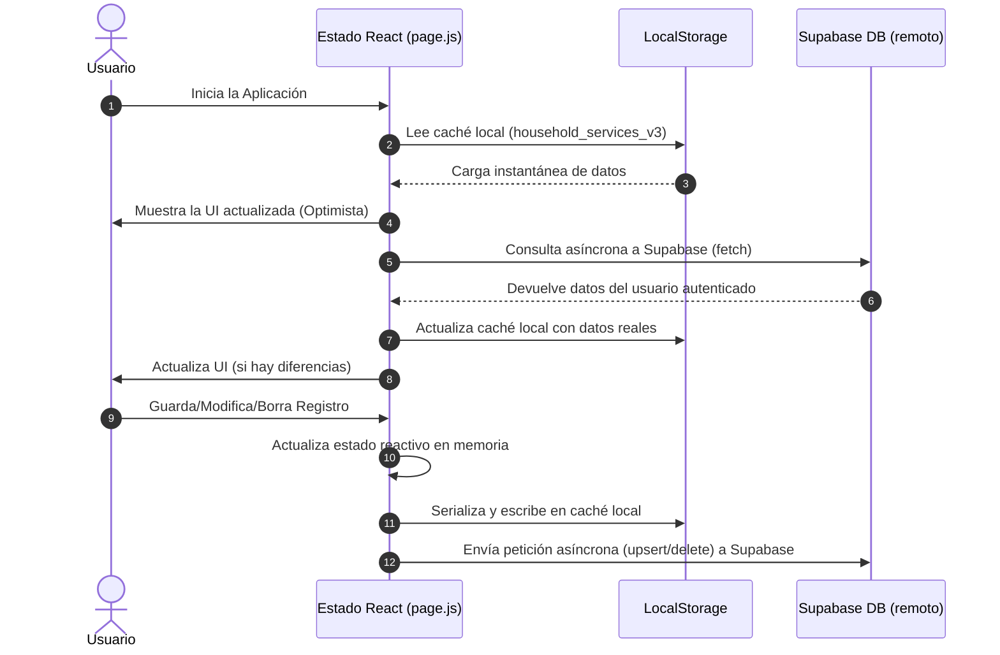

# Documentación Técnica Exhaustiva del Sistema: ServiTrack (Next.js & React)

ServiTrack es una aplicación web del tipo **Single Page Application (SPA)** de nivel premium diseñada para la gestión, organización y análisis de gastos y servicios del hogar.

Originalmente concebida como una aplicación en JavaScript Vanilla, el sistema ha sido migrado por completo a **Next.js** y **React**, incorporando una arquitectura moderna de componentes, compilación optimizada en **Node.js**, y persistencia robusta en la nube con **Supabase** (Auth & Database).

Este documento proporciona una referencia técnica exhaustiva de la arquitectura, estructura de archivos, modelos de datos, componentes de interfaz y guías de despliegue para desarrolladores.

---

## 1. Arquitectura General y Transición Tecnológica

### 1.1 De Vanilla JS a Next.js + React

La migración de la base de código aportó mejoras significativas en mantenibilidad, seguridad y rendimiento:

- **Interfaz Declarativa vs. Imperativa:** En la versión anterior (Vanilla), cada actualización de estado requería la manipulación manual del DOM (`document.getElementById`, concatenación de templates HTML con backticks e inyección mediante `.innerHTML`). En React, la UI se declara en función del estado actual. Cuando los estados (`services`, `currentMonthIndex`, `editingItem`, etc.) cambian, React realiza un diff del DOM virtual y actualiza únicamente los nodos necesarios.
- **Modularidad Estricta:** Todo el código se dividió en componentes reutilizables y autocontenidos en `src/components/`, separando la presentación de la lógica de persistencia.
- **Empaquetado y Dependencias:** Se reemplazaron las importaciones globales mediante CDN en HTML por un flujo de compilación moderno basado en **npm** y **Next.js (Webpack/SWC)**. Esto permite el tipado implícito, optimizaciones estáticas y bundling eficiente de librerías como `Chart.js` y `ExcelJS`.
- **Seguridad:** Las variables sensibles y la configuración de API ahora se leen a través de variables de entorno seguras (`.env.local`), evitando exponer credenciales fijas en el código de producción.

### 1.2 Flujo de Datos Híbrido (UI Optimista)

Para maximizar la velocidad percibida del usuario, ServiTrack utiliza una estrategia de sincronización optimista:



---

## 2. Estructura Completa del Proyecto

A continuación, se detalla el árbol de directorios y la responsabilidad de cada archivo:

```
/ (Raíz del proyecto)
├── package.json               # Dependencias de npm y scripts de ejecución/compilación
├── next.config.mjs            # Parámetros de configuración del compilador Next.js
├── postcss.config.mjs         # Procesamiento de estilos CSS
├── tailwind.config.js         # Configuración del motor de estilos Tailwind CSS
├── jsconfig.json              # Configuración de alias de rutas (ej. @/components)
├── .eslintrc.json             # Reglas de análisis estático y linteo
├── .prettierrc                # Formato y estilo de código estandarizado
├── .env.example               # Muestra de las variables de entorno necesarias
├── src/
│   ├── app/
│   │   ├── layout.js          # Estructura HTML raíz, carga de tipografía y metadatos SEO
│   │   ├── globals.css        # Estilos globales, variables CSS y scrollbars premium
│   │   └── page.js            # Punto de entrada de la SPA, estado global y sincronización
│   ├── components/
│   │   ├── AuthComponent.js   # Panel de autenticación (Login/Registro con Supabase)
│   │   ├── Dashboard.js       # Dashboard principal (Cálculos financieros, tabs y carga de archivos)
│   │   ├── ServiceForm.js     # Formulario de carga y edición con detección semántica
│   │   ├── ServiceList.js     # Contenedor filtrado y agrupador de tarjetas
│   │   ├── ServiceCard.js     # Renderizado dinámico de tarjetas según el tipo de registro
│   │   ├── SimulationModal.js # Modal del simulador financiero (Algoritmo Greedy)
│   │   └── ChartsModal.js     # Modal de gráficos con Chart.js (Proyección y consumo físico)
│   └── lib/
│       ├── supabase.js        # Inicialización del cliente de Supabase
│       ├── utils.js           # Formateadores financieros y helpers generales
│       └── excelHelper.js     # Motor de importación y exportación de archivos Excel
```

---

## 3. Modelo de Datos y Base de Datos

### 3.1 Estructura del Objeto Financiero (`ServiceItem`)

Todos los registros en memoria y base de datos respetan el siguiente esquema de campos:

| Campo                 | Tipo                                           | Requerido | Descripción                                                      |
| --------------------- | ---------------------------------------------- | --------- | ---------------------------------------------------------------- |
| `id`                  | `string`                                       | Sí        | Identificador único del registro (generado con timestamp + hash) |
| `user_id`             | `uuid`                                         | Sí        | Clave foránea del usuario creador (relacionado a `auth.users`)   |
| `type`                | `'service' \| 'loan' \| 'overdue' \| 'income'` | Sí        | Tipo de registro                                                 |
| `name`                | `string`                                       | Sí        | Nombre descriptivo del gasto o ingreso (ej: "Luz Edesur")        |
| `amount`              | `number`                                       | Sí        | Importe del registro (flotante de precisión simple)              |
| `paymentMonth`        | `number`                                       | Sí        | Índice del mes asignado para el pago (0 = Enero, 11 = Diciembre) |
| `isPaid`              | `boolean`                                      | Sí        | Determina si el gasto está pago (siempre `false` para ingresos)  |
| `paymentDate`         | `string`                                       | Opcional  | Fecha de pago registrada (formato local `'es-AR'`)               |
| `consumptionMonth`    | `number`                                       | Opcional  | Mes inicial del periodo de consumo (sólo servicios/atrasados)    |
| `consumptionMonthEnd` | `number \| null`                               | Opcional  | Mes final del periodo de consumo (sólo servicios/atrasados)      |
| `consumptionUnit`     | `number`                                       | Opcional  | Unidades consumidas (kWh / m³ - sólo servicios de energía/gas)   |
| `nextMeasurementDate` | `number`                                       | Opcional  | Día del mes para la toma del estado (1-31)                       |
| `billingCloseDate`    | `number`                                       | Opcional  | Día del mes del cierre de factura (1-31 - sólo internet/cable)   |
| `creditor`            | `string`                                       | Opcional  | Nombre del banco o prestamista (sólo préstamos)                  |
| `currentInstallment`  | `number`                                       | Opcional  | Cuota actual (sólo préstamos)                                    |
| `totalInstallments`   | `number`                                       | Opcional  | Total de cuotas a abonar (sólo préstamos)                        |
| `titular`             | `string`                                       | Opcional  | Persona titular a cargo del pago del préstamo                    |

### 3.2 SQL DDL (Esquema en Supabase)

Script SQL para la creación de la tabla `services` y habilitación de seguridad de filas (RLS) en la consola de Supabase:

```sql
-- Crear la tabla de servicios
create table public.services (
  id text not null primary key,
  created_at timestamp with time zone default timezone('utc'::text, now()) not null,
  user_id uuid references auth.users(id) on delete cascade default auth.uid(),
  type text not null check (type in ('service', 'loan', 'overdue', 'income')),
  name text not null,
  amount numeric not null,
  "paymentMonth" integer not null check ("paymentMonth" >= 0 and "paymentMonth" <= 11),
  "isPaid" boolean not null default false,
  "paymentDate" text,
  "consumptionMonth" integer,
  "consumptionMonthEnd" integer,
  "consumptionUnit" numeric,
  "nextMeasurementDate" integer,
  "billingCloseDate" integer,
  creditor text,
  "currentInstallment" integer,
  "totalInstallments" integer,
  titular text
);

-- Habilitar Row Level Security (RLS)
alter table public.services enable row level security;

-- Crear políticas de seguridad para que los usuarios solo accedan a sus propios datos
create policy "Los usuarios pueden ver solo sus propios servicios"
  on public.services for select
  using (auth.uid() = user_id);

create policy "Los usuarios pueden insertar sus propios servicios"
  on public.services for insert
  with check (auth.uid() = user_id);

create policy "Los usuarios pueden actualizar sus propios servicios"
  on public.services for update
  using (auth.uid() = user_id)
  with check (auth.uid() = user_id);

create policy "Los usuarios pueden eliminar sus propios servicios"
  on public.services for delete
  using (auth.uid() = user_id);
```

---

## 4. Detalle y Flujo de los Componentes Reactivos

### 4.1 Punto de Entrada: [page.js](file:///c:/Users/AALEJ/OneDrive/Desktop/Instituto_26/git-hub/Gestion-de-servicios/src/app/page.js)

Orquesta el estado global de la aplicación.

- **`session`**: Obtenido a través de la API de autenticación de Supabase. Determina si se renderiza el formulario de login/registro o el dashboard de la aplicación.
- **`services`**: Array con todos los registros financieros del usuario actual.
- **`currentMonthIndex`**: Número entero (0-11) que determina el mes visualizado en la pantalla principal.

#### Funciones Principales del CRUD:

- `handleSaveItem(itemData)`: Maneja tanto la creación como la edición. Si el elemento posee `id`, actualiza el array local (`map`) y ejecuta un `upsert` a Supabase. Si no posee `id`, genera uno único, lo añade al array y lo sube.
- `handleDeleteItem(id)`: Remueve el elemento del estado local y realiza la eliminación física en Supabase filtrando por el identificador del registro.
- `handleTogglePaid(id)`: Invierte el estado de `isPaid`. Si el nuevo estado es `true`, añade la fecha formateada en formato `es-AR` mediante `new Date().toLocaleDateString('es-AR')`; de lo contrario, elimina el atributo `paymentDate`.
- `handleImportPrevious()`: Algoritmo para agilizar el inicio de un nuevo mes. Filtra los elementos del mes anterior y los importa en el mes actual si sus nombres no existen (evitando duplicidades). Para los registros importados:
  - Incrementa el `consumptionMonth` al mes actual.
  - Establece `isPaid` en `false`.
  - Si es un préstamo (`loan`), incrementa en 1 la cuota actual (`currentInstallment`), siempre y cuando sea menor al total de cuotas.

### 4.2 Formulario Dinámico: [ServiceForm.js](file:///c:/Users/AALEJ/OneDrive/Desktop/Instituto_26/git-hub/Gestion-de-servicios/src/components/ServiceForm.js)

Este formulario cuenta con detección inteligente de campos basándose en el texto ingresado por el usuario en el campo "Nombre":

- **Lógica de detección:**
  ```javascript
  const isEnergyRelated =
    name.toLowerCase().includes('luz') ||
    name.toLowerCase().includes('gas') ||
    name.toLowerCase().includes('energia');
  const isInternetRelated =
    name.toLowerCase().includes('internet') ||
    name.toLowerCase().includes('wifi') ||
    name.toLowerCase().includes('cable');
  const showDynamicFields =
    (type === 'service' || type === 'overdue') &&
    (isEnergyRelated || isInternetRelated);
  ```
- Si `isEnergyRelated` es verdadero, el formulario renderiza los campos numéricos de **Consumo Físico (kWh/m³)** y **Día de Medición**.
- Si `isInternetRelated` es verdadero, renderiza el campo de **Día de Cierre de Factura**.
- El componente responde a la propiedad `editingItem` poblando el formulario con los datos cargados para la edición y permitiendo cancelar la operación mediante un botón dedicado.

### 4.3 Fórmulas Matemáticas del Dashboard: [Dashboard.js](file:///c:/Users/AALEJ/OneDrive/Desktop/Instituto_26/git-hub/Gestion-de-servicios/src/components/Dashboard.js)

El componente calcula dinámicamente las siguientes variables a partir del array `services` filtrado por el mes seleccionado (`paymentMonth === currentMonthIndex`):

- **Ingresos Netos ($I_{net}$):** Suma de montos de ingresos.
  $$I_{net} = \sum_{i \in \text{ingresos}} \text{amount}_i$$
- **Gastos Totales ($G_{tot}$):** Suma de montos de todos los elementos excepto ingresos.
  $$G_{tot} = \sum_{g \in \text{gastos}} \text{amount}_g$$
- **Total Pagado ($P_{tot}$):** Suma de montos de gastos marcados como pagos.
  $$P_{tot} = \sum_{g \in \text{gastos}, \, \text{isPaid} = \text{true}} \text{amount}_g$$
- **Deuda Pendiente ($D_{pend}$):** Suma de montos de gastos sin pagar.
  $$D_{pend} = \sum_{g \in \text{gastos}, \, \text{isPaid} = \text{false}} \text{amount}_g$$
- **Liquidez ($L$):** Remanente real del dinero cobrado menos lo que ya se pagó.
  $$L = I_{net} - P_{tot}$$
- **Proyección de Saldo ($R$):** Dinero con el que contará el usuario al finalizar el mes una vez liquidadas todas las deudas pendientes.
  $$R = I_{net} - G_{tot}$$

### 4.4 Simulador Financiero: [SimulationModal.js](file:///c:/Users/AALEJ/OneDrive/Desktop/Instituto_26/git-hub/Gestion-de-servicios/src/components/SimulationModal.js)

Permite realizar simulaciones del impacto de altas de servicios ficticios o rebajas de servicios actuales sin alterar los datos reales de la base de datos.

#### Algoritmo Codicioso (Greedy) de Sugerencias

Cuando la simulación arroja un saldo de ahorro positivo ($S_{net} > 0$), el sistema calcula automáticamente qué gastos reales pendientes podrían cubrirse con este dinero ahorrado:

1.  Filtra todos los servicios pendientes de pago del mes actual que no están incluidos en la simulación activa.
2.  Ordena los gastos filtrados de **menor a mayor** importe.
3.  Itera sobre los elementos ordenados:
    - Si el costo del servicio es menor o igual al saldo de ahorro restante, se añade a la lista de "sugeridos a pagar" y se resta el costo del saldo de ahorro.
    - Si el saldo de ahorro restante es menor al costo del servicio pero mayor a cero, se añade a la lista de "cobertura parcial", calculando el porcentaje de cobertura:
      $$\text{Cobertura} (\%) = \left( \frac{\text{Saldo Restante}}{\text{Monto del Servicio}} \right) \times 100$$
4.  Esta lista de recomendaciones se visualiza inmediatamente al usuario en un panel interactivo dentro del modal.

### 4.5 Módulo de Gráficos: [ChartsModal.js](file:///c:/Users/AALEJ/OneDrive/Desktop/Instituto_26/git-hub/Gestion-de-servicios/src/components/ChartsModal.js)

Utiliza la biblioteca **Chart.js** mapeando los datos de forma reactiva y pintándolos sobre un `<canvas>` HTML5.

- **Gráfico de Proyección Anual:** Agrupa todos los gastos pendientes acumulados a lo largo del año por nombre de servicio. Utiliza barras apiladas (`stacked: true`) para identificar la distribución y peso de cada deuda mes a mes.
- **Gráfico de Consumo Físico:** Filtra aquellos servicios que poseen registrada la propiedad de consumo físico (`consumptionUnit`). Mapea una línea suavizada (`tension: 0.3`) a lo largo de los meses del año para graficar la evolución estacional del consumo de recursos del hogar (Luz o Gas).
- **Gestión del ciclo de vida:** Para prevenir fugas de memoria y errores en la interfaz por canvases ya utilizados, el modal encapsula la inicialización dentro de un hook `useEffect` y retorna una función de limpieza para destruir de forma segura la instancia del gráfico (`chartInstanceRef.current.destroy()`) al desmontar el componente.

---

## 5. Motor de Excel (Importación / Exportación)

El archivo [excelHelper.js](file:///c:/Users/AALEJ/OneDrive/Desktop/Instituto_26/git-hub/Gestion-de-servicios/src/lib/excelHelper.js) gestiona la lectura y escritura de archivos `.xlsx` usando la librería `exceljs`.

### 5.1 Exportación Premium

Genera un libro con estilos corporativos:

- **Estética:** Utiliza tipografía corporativa **Inter**, con encabezados de tabla oscuros (`#0F172A`), alternancia de filas en colores pastel (Zebra striping con `#F8FAFC`), bordes sutiles y remoción de la grilla predeterminada de Excel para mayor limpieza visual.
- **Formato de Valores:** Las columnas numéricas de importe se configuran con el formato de moneda argentina `"$"\#,##0.00`.
- **Fórmulas y Agrupamiento:** Agrupa los servicios del año mes a mes. Al final de cada mes, escribe subtotales sumando gastos e ingresos, y genera un balance neto del periodo. Adicionalmente, incluye un bloque de resumen al final del archivo con fórmulas matemáticas nativas de Excel para el balance anual.

### 5.2 Importación Inteligente

Permite importar registros de planillas arrastrando y soltando archivos sobre el dashboard:

1.  **Detección Dinámica de Cabecera:** En lugar de exigir una estructura rígida de columnas, lee la primera fila y mapea dinámicamente las posiciones en base a palabras clave (ej: si detecta "monto", "importe" o "valor", asocia esa columna a la propiedad `amount`).
2.  **Limpieza de Datos:** Ignora de forma automática celdas vacías y filas acumuladoras de totales o subtotales (por ejemplo, filas que contengan la palabra "Total").
3.  **Conversión de Fechas y Estados:** Convierte textos de estado como "PAGADO", "✔" o "SI" a booleanos `isPaid = true`.
4.  **Prevención de Duplicados:** Valida cada fila extraída contra los servicios del mes ya existentes en la aplicación. Si el nombre y el mes del servicio coinciden, la fila se descarta para evitar registros duplicados.

---

## 6. Scripts y Calidad de Código

El proyecto integra scripts específicos en [package.json](file:///c:/Users/AALEJ/OneDrive/Desktop/Instituto_26/git-hub/Gestion-de-servicios/package.json) para agilizar las tareas de desarrollo y asegurar la consistencia del código:

```json
"scripts": {
  "dev": "next dev",
  "build": "next build",
  "start": "next start",
  "lint": "next lint",
  "format": "prettier --write \"src/**/*.{js,jsx,css,md}\""
}
```

### 6.1 Instrucciones de Comandos

- `npm run dev`: Inicia el servidor de desarrollo local en `http://localhost:3000`.
- `npm run build`: Compila la aplicación para producción. Este comando ejecuta el análisis estático de **ESLint**, valida tipos e imports y optimiza el bundle final. No debe arrojar warnings ni errores para que el deploy sea exitoso.
- `npm run lint`: Ejecuta el validador de código estático de Next.js (`next/core-web-vitals`), identificando malas prácticas, imports huérfanos o variables declaradas sin uso.
- `npm run format`: Formatea automáticamente la estructura y sintaxis de todos los archivos del proyecto bajo las directivas del archivo `.prettierrc`.

---

## 7. Configuración e Instalación del Proyecto

### 7.1 Requisitos Previos

- **Node.js**: Versión 18.0.0 o superior instalada.
- **npm**: Versión 9.0.0 o superior.

### 7.2 Variables de Entorno

Crea un archivo `.env.local` en la raíz del proyecto y define las claves de acceso de tu proyecto en Supabase:

```env
NEXT_PUBLIC_SUPABASE_URL=https://tu-proyecto.supabase.co
NEXT_PUBLIC_SUPABASE_ANON_KEY=tu-clave-anonima-supabase
```

### 7.3 Instrucciones de Ejecución Paso a Paso

1.  Clona el repositorio e ingresa al directorio del proyecto.
2.  Instala las dependencias necesarias:
    ```bash
    npm install
    ```
3.  Ejecuta el formateador para asegurar el estilo de código:
    ```bash
    npm run format
    ```
4.  Lanza el servidor de desarrollo local:
    ```bash
    npm run dev
    ```
5.  Abre `http://localhost:3000` en tu navegador.
6.  Para compilar y verificar el bundle de producción, ejecuta:
    ```bash
    npm run build
    ```
