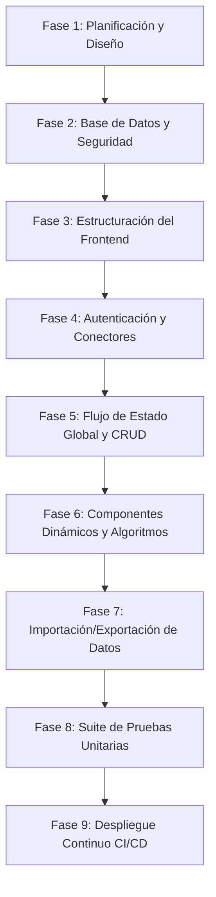

# 🚀 Guía de Desarrollo Paso a Paso — ServiTrack desde Cero

Esta guía detalla el proceso estructurado y la hoja de ruta técnica para concebir, diseñar, codificar, probar y desplegar **ServiTrack** si tuvieses que construir el proyecto de forma individual desde cero.

---

## 📌 Mapa de Ruta de Desarrollo



---

## 📂 Fase 1: Planificación y Modelo de Datos
Antes de codificar, es clave definir los requerimientos funcionales y el modelo de datos.

1. **Requerimientos Clave:**
   - Autenticación segura de usuarios (Login, registro, recuperación de contraseña).
   - Dashboard financiero en tiempo real (métrica de ingresos netos, gastos totales, pagados, deudas, liquidez y proyecciones).
   - Formulario interactivo con campos dinámicos y autocompletado según el nombre ingresado.
   - Simulador financiero para evaluar altas/bajas de servicios mediante un algoritmo Greedy de asignación.
   - Exportación de informes mensuales a Excel e importación masiva por planillas.
   - Visualización de estadísticas con gráficos interactivos.

2. **Diseño del Recurso Financiero (`ServiceItem`):**
   Definición de las propiedades que tendrá cada registro de gasto o ingreso:
   - `id`: Identificador único (UUID v4).
   - `user_id`: Identificador del usuario (Relación con la tabla auth del sistema).
   - `type`: Tipo de registro (`service` | `loan` | `overdue` | `income`).
   - `name`: Nombre del registro (ej: "Luz Edesur").
   - `amount`: Importe (flotante positivo).
   - `paymentMonth`: Mes asignado para el pago (0-11).
   - `isPaid`: Booleano (si está abonado o no).
   - `paymentDate`: Fecha exacta de pago.
   - `dueDate`: Fecha nativa de vencimiento (`YYYY-MM-DD`).
   - `paymentSource`: Origen de fondos (`SELF` | `THIRD_PARTY`).

---

## 🔒 Fase 2: Configuración del Backend y Seguridad (Supabase)
Utilizaremos **Supabase** como plataforma Backend-as-a-Service (BaaS) montada sobre PostgreSQL.

1. **Crear el proyecto** en la consola de Supabase.
2. **Ejecutar el esquema SQL DDL** en la base de datos para crear la tabla de `services` y definir sus restricciones (`CHECK constraints` para que los importes nunca sean negativos, etc.):
   ```sql
   CREATE EXTENSION IF NOT EXISTS "uuid-ossp";

   CREATE TABLE public.services (
     id uuid NOT NULL DEFAULT uuid_generate_v4() PRIMARY KEY,
     created_at timestamp with time zone DEFAULT timezone('utc'::text, now()) NOT NULL,
     user_id uuid REFERENCES auth.users(id) ON DELETE CASCADE DEFAULT auth.uid(),
     type text NOT NULL,
     name text NOT NULL,
     amount numeric NOT NULL,
     "paymentMonth" integer NOT NULL,
     "isPaid" boolean NOT NULL DEFAULT false,
     "paymentDate" text,
     "dueDate" date,
     "consumptionMonth" integer,
     "consumptionUnit" numeric,
     "nextMeasurementDate" integer,
     "billingCloseDate" integer,
     creditor text,
     "currentInstallment" integer,
     "totalInstallments" integer,
     titular text,
     "paymentSource" text NOT NULL DEFAULT 'SELF',
     is_demo boolean DEFAULT false,

     CONSTRAINT chk_amount_positive CHECK (amount >= 0),
     CONSTRAINT chk_type_valid CHECK (type IN ('service', 'loan', 'overdue', 'income')),
     CONSTRAINT chk_payment_month CHECK ("paymentMonth" >= 0 AND "paymentMonth" <= 11),
     CONSTRAINT chk_payment_source CHECK ("paymentSource" IN ('SELF', 'THIRD_PARTY'))
   );
   ```
3. **Activar Row Level Security (RLS):**
   Garantiza el aislamiento absoluto de datos entre usuarios utilizando la variable de contexto de sesión del servidor `auth.uid()`:
   ```sql
   ALTER TABLE public.services ENABLE ROW LEVEL SECURITY;

   CREATE POLICY "Lectura de registros propios"
     ON public.services FOR SELECT USING (auth.uid() = user_id);

   CREATE POLICY "Inserción de registros propios"
     ON public.services FOR INSERT WITH CHECK (auth.uid() = user_id);

   CREATE POLICY "Actualización de registros propios"
     ON public.services FOR UPDATE USING (auth.uid() = user_id) WITH CHECK (auth.uid() = user_id);

   CREATE POLICY "Eliminación de registros propios"
     ON public.services FOR DELETE USING (auth.uid() = user_id);
   ```
4. **Optimización con Índices:**
   Crear un índice compuesto para agilizar las consultas por usuario y mes:
   ```sql
   CREATE INDEX idx_services_user_month ON public.services(user_id, "paymentMonth");
   ```

---

## 🛠️ Fase 3: Estructuración del Frontend (Next.js & Tailwind CSS)
1. **Inicializar la aplicación** en el directorio raíz:
   ```bash
   npx create-next-app@latest ./ --js --tailwind --eslint
   ```
   *(Seleccionar App Router para el manejo dinámico de rutas y compatibilidad con Server/Client Components).*
2. **Instalar paquetes del proyecto:**
   ```bash
   npm install @supabase/supabase-js chart.js react-chartjs-2 exceljs file-saver
   npm install --save-dev jest babel-jest @testing-library/react @testing-library/jest-dom
   ```
3. **Estructura del Código:**
   Organizar las carpetas para separar la lógica de presentación de la lógica de conexión y utilitarios:
   ```text
   ├── src/
   │   ├── app/
   │   │   ├── layout.js          # Raíz del layout (Tipografías, Head)
   │   │   ├── globals.css        # Configuración de Tailwind y variables CSS
   │   │   └── page.js            # Controlador principal y estado reactivo
   │   ├── components/            # Componentes modulares
   │   └── lib/                   # Clientes de API, Excel y helpers de fechas/cálculos
   ```

---

## 🔑 Fase 4: Integración del Cliente Supabase y Autenticación
1. **Configurar el archivo `.env.local`** con las credenciales públicas de Supabase:
   ```env
   NEXT_PUBLIC_SUPABASE_URL=https://tu-proyecto.supabase.co
   NEXT_PUBLIC_SUPABASE_ANON_KEY=tu-clave-anonima-supabase
   ```
2. **Crear el Cliente Supabase** en `src/lib/supabase.js`:
   ```javascript
   import { createClient } from '@supabase/supabase-js';

   const supabaseUrl = process.env.NEXT_PUBLIC_SUPABASE_URL;
   const supabaseAnonKey = process.env.NEXT_PUBLIC_SUPABASE_ANON_KEY;

   export const supabase = createClient(supabaseUrl, supabaseAnonKey);
   ```
3. **Construir `AuthComponent.js`:**
   Crear un panel de autenticación elegante que maneje login, registro y restablecimiento de contraseñas usando `supabase.auth.signInWithPassword` y `signUp`.

---

## ⚡ Fase 5: Controlador de Estado Global y Operaciones CRUD
Para evitar problemas de sincronización asíncrona, centralizamos la base del estado en el archivo [src/app/page.js](file:///c:/Users/Desktop/OneDrive/Desktop/Git%20Hub/Gestion-de-servicios/src/app/page.js):

1. **Suscribirse a cambios de sesión:**
   Utilizar `supabase.auth.onAuthStateChange` en un `useEffect` para guardar al usuario autenticado. Si no hay sesión, se muestra el formulario de autenticación; de lo contrario, se cargan los servicios y se muestra el dashboard.
2. **Desarrollar operaciones CRUD Optimistas:**
   - **Lectura:** Hacer un fetch filtrando los servicios de la cuenta activa.
   - **Guardado/Edición (`handleSaveItem`):** Si posee `id`, actualizar el estado local en React e invocar `supabase.from('services').upsert()`. Si no tiene `id`, enviarlo a Supabase para que Postgres le asigne un UUID, recibir la fila creada con `.select().single()`, y agregarla al estado local.
   - **Cambio de Estado Pagado (`handleTogglePaid`):** Cambiar el booleano `isPaid`. Si es `true`, insertar la fecha formateada en formato `es-AR` mediante `new Date().toLocaleDateString('es-AR')`; si es `false`, borrar el campo `paymentDate`.
   - **Importación de Periodo Anterior (`handleImportPrevious`):** Clonar en memoria los registros repetibles del mes anterior, remover sus claves primarias e insertarlos masivamente con una sola petición `insert().select()` en Supabase.

---

## 🧱 Fase 6: Creación de Componentes de la Interfaz

### 1. Dashboard de Métricas (`Dashboard.js`)
Procesar el array de servicios aplicando fórmulas matemáticas en el lado del cliente (React):
- **Ingresos Netos ($I_{net}$):** Sumatoria de montos de elementos de tipo `income`.
- **Gastos Totales ($G_{tot}$):** Sumatoria de montos de elementos que no sean `income`.
- **Total Pagado ($P_{tot}$):** Sumatoria de gastos donde `isPaid === true` y `paymentSource !== 'THIRD_PARTY'` (gastos propios abonados).
- **Deuda Pendiente ($D_{pend}$):** Gastos donde `isPaid === false`.
- **Liquidez ($L$):** $I_{net} - P_{tot}$.
- **Proyección de Saldo ($R$):** $I_{net} - G_{tot}$.

### 2. Formulario Inteligente y Semántico (`ServiceForm.js`)
Programar un analizador de texto que escuche la escritura en el campo del nombre del servicio:
- Si el usuario escribe palabras claves como `"luz"`, `"gas"`, `"electricidad"`, `"edesur"` o `"metrogas"` $\rightarrow$ Habilitar automáticamente los campos para cargar el consumo físico (**kWh** / **m³**) y el día de medición.
- Si escribe `"internet"`, `"wifi"` o `"cable"` $\rightarrow$ Mostrar el selector de día de cierre de factura.
- Integrar un campo de fecha nativo (`dueDate`) que sincronice en espejo las columnas legadas al guardar el registro.

### 3. Simulador Financiero (`SimulationModal.js`)
Implementar una simulación aislada de presupuesto (altas y bajas ficticias):
- **Algoritmo Greedy (Codicioso):** Ordenar los servicios pendientes de pago de menor a mayor importe. Mientras exista presupuesto (ahorro neto obtenido en la simulación), asignar el pago completo a los servicios más económicos para saldar la mayor cantidad de facturas posibles. Si sobra presupuesto pero no alcanza para pagar la totalidad de la siguiente factura, calcular el porcentaje de cobertura parcial.

### 4. Gráficos Interactivos (`ChartsModal.js`) y Onboarding (`WelcomeModal.js`)
- Renderizar gráficos mensuales de barras y líneas para ver el comportamiento del consumo físico e histórico de gastos con `Chart.js`.
- Configurar un carrusel de bienvenida en 2 pasos para nuevos usuarios, guardando la aceptación de la política de privacidad mediante `user_metadata` en Supabase Auth.

---

## 📊 Fase 7: Utilidad de Importación/Exportación de Planillas (ExcelJS)
Crear un archivo utilitario `src/lib/excelHelper.js`:
1. **Exportar a Excel:** Instanciar un `Workbook`, generar la pestaña activa, rellenar los datos con los servicios del mes con estilos aplicados (fuentes en negrita, colores de fondo según categoría y formato de moneda en celdas de importe), y guardarlo en formato binario mediante `file-saver`.
2. **Importar desde Excel:** Configurar un lector de archivos subidos por el usuario. Leer la cabecera del archivo, extraer las filas iterando las celdas, realizar transformaciones seguras para limpiar valores numéricos mal formateados, y cargarlos por bloques mediante la API de inserción masiva.

---

## 🧪 Fase 8: Pruebas Unitarias y Calidad de Código (Jest)
Implementar una batería de pruebas automatizadas para proteger la lógica crítica del negocio contra regresiones:
- Validar las funciones de ajuste de fechas virtuales en meses con límites de días (por ejemplo, asegurando que el 29 de febrero en años no bisiestos o el 31 de abril no provoquen un error de desbordamiento en JS).
- Comprobar que los gastos pagados por terceros no afecten la liquidez propia en el cálculo del balance general.
- Ejecutar la suite mediante el script:
  ```bash
  npm run test
  ```

---

## 🚀 Fase 9: Despliegue Continuo (Vercel)
1. Subir el proyecto a un repositorio en **GitHub**.
2. Crear un nuevo proyecto en **Vercel** e importarlo desde GitHub.
3. Configurar las variables de entorno en la configuración de Vercel (`NEXT_PUBLIC_SUPABASE_URL` y `NEXT_PUBLIC_SUPABASE_ANON_KEY`).
4. Vercel compilará la SPA y la desplegará globalmente con HTTPS automático y CDN integrada. Cada cambio subido a la rama `main` disparará un nuevo despliegue automático.

---

## 💡 Buenas Prácticas de Ingeniería Aplicadas
*   **Seguridad Activa (RLS):** Nunca delegar la seguridad solo al cliente. El uso de Row Level Security en la base de datos PostgreSQL garantiza que los datos estén aislados incluso ante hackeos en el navegador.
*   **Sin LocalStorage (Prevención de XSS):** Almacenar montos o credenciales financieras en el almacenamiento local expone la información ante inyecciones de scripts de terceros. Consumir la base de datos remota con validación activa de sesión es la opción recomendada.
*   **Renderizado Declarativo:** React maneja el estado de forma síncrona en memoria y actualiza selectivamente el DOM. Esto evita el código espagueti típico de manipulaciones manuales en Vanilla Javascript.
