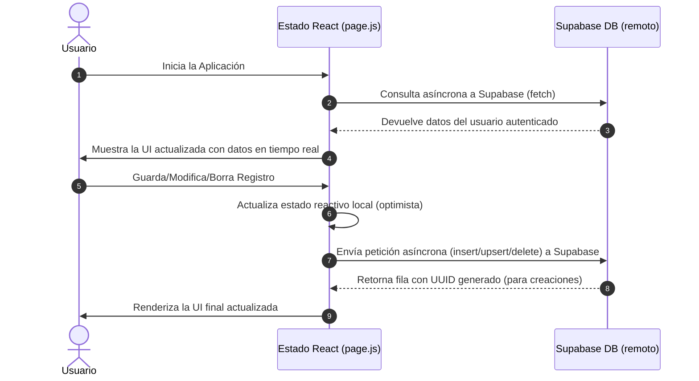

# 🛠️ Documentación Técnica Unificada — ServiTrack

ServiTrack es una aplicación web del tipo **Single Page Application (SPA)** de nivel premium diseñada para la gestión, organización y análisis de gastos y servicios del hogar.

---

## 1. Arquitectura General y Transición Tecnológica

### 1.1 Evolución de Vanilla JS a Next.js + React

La migración de la base de código aportó mejoras significativas en mantenibilidad, seguridad y rendimiento:

- **Interfaz Declarativa vs. Imperativa:** En la versión anterior (Vanilla), cada actualización de estado requería la manipulación manual del DOM. En React, la UI se declara en función del estado actual (`services`, `currentMonthIndex`, `editingItem`, etc.). Cuando estos cambian, React realiza un diff del DOM virtual y actualiza únicamente los nodos necesarios.
- **Modularidad Estricta:** El código se divide en componentes reutilizables y autocontenidos en `src/components/`, separando la presentación de la lógica de persistencia.
- **Empaquetado y Dependencias:** Se reemplazaron las importaciones globales mediante CDN en HTML por un flujo de compilación moderno basado en **npm** y **Next.js (Webpack/SWC)**.
- **Seguridad:** Las variables sensibles y la configuración de API se leen a través de variables de entorno seguras (`.env.local`), evitando exponer credenciales fijas en el código de producción.

### 1.2 Flujo de Datos en Tiempo Real (Sin Almacenamiento Local)

Para garantizar la máxima seguridad en el manejo de datos financieros, ServiTrack se conecta directamente y en tiempo real a la base de datos de Supabase, eliminando por completo el almacenamiento en caché local (`localStorage`) que era propenso a ataques XSS:



---

## 2. Pila Tecnológica del Proyecto

### 2.1 Núcleo (Core)

- **Next.js (`^14.1.4`):** React Framework utilizado para estructurar la SPA. Emplea el enrutador App Router y la directiva `'use client'` para el manejo reactivo del estado en el lado del cliente.
- **React (`^18.2.0`) & React DOM (`^18.2.0`):** Biblioteca base para la creación de componentes dinámicos y reutilizables.

### 2.2 Base de Datos, Autenticación y Seguridad

- **Supabase Client (`@supabase/supabase-js ^2.39.8`):** Plataforma Backend-as-a-Service (BaaS).
  - **Supabase Auth:** Manejo de sesiones de usuario persistentes, registro, login y restablecimiento de contraseña.
  - **Supabase Database (PostgreSQL):** Persistencia de registros de servicios y RLS (Row Level Security) activo para aislar la información por identificador de usuario (`auth.uid() = user_id`).

### 2.3 Estilos y Diseño Visual (Aesthetics)

- **Tailwind CSS (`^3.4.1`):** Framework CSS utilitario para la maquetación responsiva rápida.
- **PostCSS (`^8.4.38`) & Autoprefixer (`^10.4.19`):** Herramientas de postprocesamiento de CSS que añaden compatibilidad entre navegadores.
- **Variables CSS Nativas & Google Fonts (Inter):** Fuente predeterminada del sistema.

### 2.4 Visualización de Datos e Informes

- **Chart.js (`^4.4.2`):** Biblioteca de renderización de gráficos interactivos a través de Canvas.
- **ExcelJS (`^4.4.0`):** Generador y lector de archivos `.xlsx` enriquecidos desde el navegador.
- **File-Saver (`^2.0.5`):** Utilidad para descargar archivos binarios en memoria directamente en el navegador.

### 2.5 Entorno de Desarrollo y Pruebas

- **Jest (`^29.7.0`):** Framework de pruebas unitarias utilizado para validar los algoritmos de cálculo de balances, deudas y sugerencias.
- **ESLint (`^8.57.0`):** Análisis estático de código.
- **Prettier (`^3.2.5`):** Formateador de código automático.

---

## 3. Modelo de Datos y Base de Datos

### 3.1 Estructura del Objeto Financiero (`ServiceItem`)

| Campo                 | Tipo                                           | Requerido | Descripción                                                       |
| --------------------- | ---------------------------------------------- | --------- | ----------------------------------------------------------------- |
| `id`                  | `uuid`                                         | Sí        | Identificador único del registro (UUIDv4 generado por PostgreSQL) |
| `legacy_id`           | `string`                                       | Opcional  | Identificador único antiguo en formato texto (auditoría/historia) |
| `user_id`             | `uuid`                                         | Sí        | Clave foránea del usuario creador (relacionado a `auth.users`)    |
| `type`                | `'service' \| 'loan' \| 'overdue' \| 'income'` | Sí        | Tipo de registro                                                  |
| `name`                | `string`                                       | Sí        | Nombre descriptivo del gasto o ingreso (ej: "Luz Edesur")         |
| `amount`              | `number`                                       | Sí        | Importe del registro (flotante de precisión simple)               |
| `paymentMonth`        | `number`                                       | Sí        | Índice del mes asignado para el pago (0 = Enero, 11 = Diciembre)  |
| `isPaid`              | `boolean`                                      | Sí        | Determina si el gasto está pago (siempre `false` para ingresos)   |
| `paymentDate`         | `string`                                       | Opcional  | Fecha de pago registrada (formato local `'es-AR'`)                |
| `dueDate`             | `string`                                       | Opcional  | Fecha de vencimiento nativa (formato `'YYYY-MM-DD'`)              |
| `consumptionMonth`    | `number`                                       | Opcional  | Mes inicial del periodo de consumo (sólo servicios/atrasados)     |
| `consumptionMonthEnd` | `number \| null`                               | Opcional  | Mes final del periodo de consumo (sólo servicios/atrasados)       |
| `consumptionUnit`     | `number`                                       | Opcional  | Unidades consumidas (kWh / m³ - sólo servicios de energía/gas)    |
| `nextMeasurementDate` | `number`                                       | Opcional  | Día del mes para la toma del estado (1-31)                        |
| `billingCloseDate`    | `number`                                       | Opcional  | Día del mes del cierre de factura (1-31 - sólo internet/cable)    |
| `creditor`            | `string`                                       | Opcional  | Nombre del banco o prestamista (sólo préstamos)                   |
| `currentInstallment`  | `number`                                       | Opcional  | Cuota actual (sólo préstamos)                                     |
| `titular`             | `string`                                       | Opcional  | Persona titular a cargo del pago del préstamo                     |
| `paymentSource`       | `'SELF' \| 'THIRD_PARTY'`                      | Opcional  | Origen de fondos para el pago (Yo o Terceros)                     |

### 3.2 SQL DDL (Esquema en Supabase v2.0)

```sql
CREATE EXTENSION IF NOT EXISTS "uuid-ossp";

create table public.services (
  id uuid not null default uuid_generate_v4() primary key,
  legacy_id text unique,
  created_at timestamp with time zone default timezone('utc'::text, now()) not null,
  user_id uuid references auth.users(id) on delete cascade default auth.uid(),
  type text not null,
  name text not null,
  amount numeric not null,
  "paymentMonth" integer not null,
  "isPaid" boolean not null default false,
  "paymentDate" text,
  "dueDate" date,
  "consumptionMonth" integer,
  "consumptionMonthEnd" integer,
  "consumptionUnit" numeric,
  "nextMeasurementDate" integer,
  "billingCloseDate" integer,
  creditor text,
  "currentInstallment" integer,
  "totalInstallments" integer,
  titular text,
  "paymentSource" text not null default 'SELF',

  -- Restricciones de validación a nivel de base de datos (CHECK constraints)
  CONSTRAINT chk_amount_positive CHECK (amount >= 0),
  CONSTRAINT chk_amount_max CHECK (amount <= 1000000000), -- Máximo 1.000 millones
  CONSTRAINT chk_type_valid CHECK (type IN ('service', 'loan', 'overdue', 'income')),
  CONSTRAINT chk_payment_month CHECK ("paymentMonth" >= 0 and "paymentMonth" <= 11),
  CONSTRAINT chk_payment_source CHECK ("paymentSource" IN ('SELF', 'THIRD_PARTY'))
);

alter table public.services enable row level security;

create policy "Los usuarios pueden ver solo sus propios servicios"
  on public.services for select
  using (auth.uid() = user_id);

create policy "Los usuarios pueden insertar sus propios servicios"
  on public.services for insert
  with check (auth.uid() = user_id);

create policy "Los usuarios pueden actualizar sus propios servicios"
  on public.services for update
  using (auth.uid() = user_id)
  with check (auth.uid() = user_id);

create policy "Los usuarios pueden eliminar sus propios servicios"
  on public.services for delete
  using (auth.uid() = user_id);

CREATE INDEX IF NOT EXISTS idx_services_user_month ON public.services(user_id, "paymentMonth");
CREATE INDEX IF NOT EXISTS idx_services_dueDate ON public.services("dueDate");
```

---

## 4. Detalle y Flujo de los Componentes Reactivos

### 4.1 Estructura Completa del Proyecto

```
/ (Raíz del proyecto)
├── package.json               # Dependencias de npm y scripts de ejecución/compilación
├── next.config.mjs            # Parámetros de configuración del compilador Next.js
├── postcss.config.mjs         # Procesamiento de estilos CSS
├── tailwind.config.js         # Configuración del motor de estilos Tailwind CSS
├── src/
│   ├── app/
│   │   ├── layout.js          # Estructura HTML raíz, carga de tipografía y metadatos
│   │   ├── globals.css        # Estilos globales y variables CSS
│   │   └── page.js            # Punto de entrada, estado global y API fetches
│   ├── components/
│   │   ├── AuthComponent.js   # Panel de autenticación (Login/Registro con Supabase)
│   │   ├── Dashboard.js       # Dashboard principal (Cálculos financieros, vencimientos)
│   │   ├── ServiceForm.js     # Formulario de carga con detección semántica
│   │   ├── ServiceList.js     # Contenedor filtrado y agrupador de tarjetas
│   │   ├── ServiceCard.js     # Renderizado de tarjetas según tipo y origen de fondos
│   │   ├── SimulationModal.js # Modal del simulador financiero (Algoritmo Greedy)
│   │   └── ChartsModal.js     # Modal de gráficos con Chart.js (Consumo estacional)
│   └── lib/
│       ├── supabase.js        # Inicialización del cliente de Supabase
│       ├── utils.js           # Formateadores financieros y helpers generales
│       └── excelHelper.js     # Motor de importación/exportación de Excel (ExcelJS)
```

### 4.2 Punto de Entrada: [page.js](file:///c:/Users/Desktop/OneDrive/Desktop/Git%20Hub/Gestion-de-servicios/src/app/page.js)

Orquesta el estado global de la aplicación.

- **`session`**: Obtenido a través de la API de autenticación de Supabase. Determina si se renderiza el formulario de login/registro o el dashboard de la aplicación.
- **`services`**: Array con todos los registros financieros del usuario actual.
- **`currentMonthIndex`**: Número entero (0-11) que determina el mes visualizado en la pantalla principal.

#### Funciones Principales del CRUD:

- `handleSaveItem(itemData)`: Maneja tanto la creación como la edición. Si el elemento posee `id` (edición), actualiza el estado local de React y hace un `upsert` a Supabase. Si no posee `id` (creación), envía el registro sin `id` a Supabase para que PostgreSQL genere el UUIDv4 (`insert().select().single()`), y luego añade la fila retornada al estado de React.
- `handleDeleteItem(id)`: Remueve el elemento del estado local y realiza la eliminación física en Supabase filtrando por el identificador del registro.
- `handleTogglePaid(id)`: Invierte el estado de `isPaid`. Si el nuevo estado es `true`, añade la fecha formateada en formato `es-AR` mediante `new Date().toLocaleDateString('es-AR')`; de lo contrario, elimina el atributo `paymentDate`.
- `handleImportPrevious()`: Algoritmo para agilizar el inicio de un nuevo mes. Filtra los elementos del mes anterior, elimina los campos `id` y `created_at` antiguos, e inserta todo el bloque en una única petición masiva en Supabase (`insert().select()`). Al recibir el éxito con los UUIDs creados, actualiza el estado de React.
- `handleBulkImport(newItems)`: Recibe la lista de registros de Excel, remueve los identificadores del cliente, y realiza una inserción por lotes en Supabase actualizando el estado de React en un solo viaje de red.

### 4.3 Formulario Dinámico: [ServiceForm.js](file:///c:/Users/Desktop/OneDrive/Desktop/Git%20Hub/Gestion-de-servicios/src/components/ServiceForm.js)

Este formulario cuenta con detección inteligente de campos basándose en el texto ingresado por el usuario en el campo "Nombre":

- **Lógica de detección:** Si el nombre contiene palabras clave como "luz", "gas" o "energia", habilita los campos numéricos de **Consumo Físico (kWh/m³)** y **Día de Medición**. Si contiene "internet", "wifi" o "cable", habilita el **Día de Cierre de Factura**.
- **Unificación de fechas:** Utiliza un input `<input type="date">` nativo mapeado a `dueDate`. Al guardar, extrae el día de la fecha seleccionada para llenar de forma espejo las columnas legacy (`nextMeasurementDate`/`billingCloseDate`), garantizando la retrocompatibilidad con las exportaciones a Excel.

### 4.4 Fórmulas Matemáticas del Dashboard: [Dashboard.js](file:///c:/Users/Desktop/OneDrive/Desktop/Git%20Hub/Gestion-de-servicios/src/components/Dashboard.js)

El componente calcula dinámicamente las siguientes variables a partir del array `services` filtrado por el mes seleccionado (`paymentMonth === currentMonthIndex`):

- **Ingresos Netos ($I_{net}$):**
  $$I_{net} = \sum_{i \in \text{ingresos}} \text{amount}_i$$
- **Gastos Totales ($G_{tot}$):**
  $$G_{tot} = \sum_{g \in \text{gastos}} \text{amount}_g$$
- **Total Pagado ($P_{tot}$):**
  $$P_{tot} = \sum_{g \in \text{gastos}, \, \text{isPaid} = \text{true}, \, \text{paymentSource} \neq \text{THIRD\_PARTY}} \text{amount}_g$$
- **Deuda Pendiente ($D_{pend}$):**
  $$D_{pend} = \sum_{g \in \text{gastos}, \, \text{isPaid} = \text{false}} \text{amount}_g$$
- **Liquidez ($L$):** Dinero real restante cobrado menos los gastos propios pagados.
  $$L = I_{net} - P_{tot}$$
- **Proyección de Saldo ($R$):**
  $$R = I_{net} - G_{tot}$$

---

## 5. Configuración e Instalación del Proyecto

### 5.1 Requisitos Previos

- **Node.js**: Versión 18.0.0 o superior.
- **npm**: Versión 9.0.0 o superior.

### 5.2 Variables de Entorno

Crea un archivo `.env.local` en la raíz del proyecto y define las claves de acceso de tu proyecto en Supabase:

```env
NEXT_PUBLIC_SUPABASE_URL=https://tu-proyecto.supabase.co
NEXT_PUBLIC_SUPABASE_ANON_KEY=tu-clave-anonima-supabase
```

### 5.3 Comandos de Ejecución

- `npm install`: Instala dependencias.
- `npm run dev`: Lanza el servidor local en `http://localhost:3000`.
- `npm run build`: Compila la aplicación optimizada para producción.
- `npm run test`: Corre la suite de pruebas unitarias con Jest.
