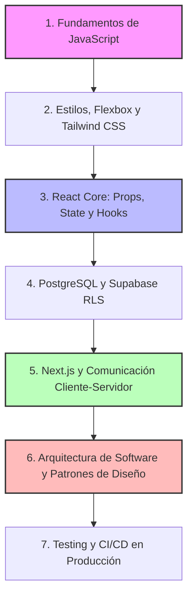

# 📚 Guía de Aprendizaje para el Desarrollo de ServiTrack

Esta guía contiene la hoja de ruta de estudio (materias, temas clave, libros y recursos) necesaria para comprender, mantener y desarrollar por tu cuenta una aplicación web de nivel profesional como **ServiTrack**.

---

## 🗺️ Mapa de Ruta de Aprendizaje

Para desarrollar una aplicación con la arquitectura de **ServiTrack** desde cero, necesitas dominar cinco grandes áreas o "materias" de la informática y el desarrollo de software. A continuación se detallan de forma progresiva.

---

### 1. Programación con JavaScript Moderno (ECMAScript 6+)

JavaScript es el motor absoluto de la aplicación, tanto para la interfaz en el navegador como para la comunicación con la base de datos.

* **Temas Clave a Dominar:**
  * **Tipos de datos y Estructuras básicas:** Objetos, arrays, operaciones de copia por valor y por referencia (crucial para no mutar el estado de React accidentalmente).
  * **Métodos funcionales de Arrays:** `.map()`, `.filter()`, `.reduce()`, `.find()`, `.some()`.
  * **Asincronía y Promesas:** Entender el bucle de eventos (`Event Loop`), `Promise`, y la sintaxis `async/await` para gestionar llamadas de red sin congelar la pantalla.
  * **Desestructuración y Operador Spread (`...`):** Muy utilizados al clonar y actualizar registros.
  * **Módulos ES6:** Importación y exportación de componentes y funciones (`import` / `export`).

* **Relación con ServiTrack:**
  * Se utiliza en la manipulación y filtrado de servicios en [page.js](file:///c:/Users/Desktop/OneDrive/Desktop/Git%20Hub/Gestion-de-servicios/src/app/page.js).
  * Es la base de las utilidades de formateo financiero en [utils.js](file:///c:/Users/Desktop/OneDrive/Desktop/Git%20Hub/Gestion-de-servicios/src/lib/utils.js).

* **Libros Recomendados:**
  * 📘 **"Eloquent JavaScript" (3ra Edición)** – Marijn Haverbeke. *(Disponible gratis en línea)*. Excelente para aprender lógica de programación y JavaScript desde las bases hasta conceptos avanzados.
  * 📘 **"You Don't Know JS Yet" (Serie de libros)** – Kyle Simpson. En especial los tomos *Get Started* y *Scope & Closures*. Es ideal para entender el "cómo" y el "por qué" interno del lenguaje.
  * 📘 **"JavaScript: The Definitive Guide" (7ma Edición)** – David Flanagan. La biblia de referencia rápida para resolver dudas específicas de sintaxis.

---

### 2. Desarrollo Frontend Moderno (React & Next.js)

React y Next.js estructuran la aplicación como una Single Page Application (SPA), permitiendo que la interfaz responda instantáneamente a las acciones del usuario.

* **Temas Clave a Dominar:**
  * **Mentalidad Declarativa vs. Imperativa:** Dejar de manipular el DOM a mano (`document.getElementById`) y empezar a pensar en la UI como una función directa del estado de la aplicación.
  * **Ciclo de Vida y Reactividad (Hooks):** 
    * `useState`: Para mantener datos locales (ej. si un modal está abierto, los datos de un formulario).
    * `useEffect`: Para sincronizar datos con servicios externos (ej. traer los servicios de Supabase al cargar la página).
  * **Flujo de Datos Unidireccional:** Paso de propiedades (`Props`) de padres a hijos.
  * **Enrutamiento y Estructura en Next.js:** El uso del App Router, layouts globales y la directiva `'use client'` para código del navegador.

* **Relación con ServiTrack:**
  * La gestión del estado de la aplicación y modales en [page.js](file:///c:/Users/Desktop/OneDrive/Desktop/Git%20Hub/Gestion-de-servicios/src/app/page.js).
  * El diseño interactivo de los modales en [SimulationModal.js](file:///c:/Users/Desktop/OneDrive/Desktop/Git%20Hub/Gestion-de-servicios/src/components/SimulationModal.js) y [ChartsModal.js](file:///c:/Users/Desktop/OneDrive/Desktop/Git%20Hub/Gestion-de-servicios/src/components/ChartsModal.js).
  * El formulario dinámico de detección semántica en [ServiceForm.js](file:///c:/Users/Desktop/OneDrive/Desktop/Git%20Hub/Gestion-de-servicios/src/components/ServiceForm.js).

* **Libros y Recursos Recomendados:**
  * 📘 **"Learning React: Modern Patterns for Developing React Apps" (2da Edición)** – Alex Banks & Eve Porcello. El mejor punto de partida práctico para entender React sin abrumarse.
  * 🌐 **Documentación Oficial de React (react.dev):** Su sección "Learn React" es interactiva, moderna y explica los hooks a la perfección.
  * 🌐 **Documentación Oficial de Next.js (nextjs.org/docs):** Esencial para comprender la estructura del App Router de Next.js 14.

---

### 3. Bases de Datos Relacionales (SQL, PostgreSQL & Supabase)

ServiTrack no almacena la información financiera sensible en el navegador del usuario por motivos de seguridad; la guarda y protege en un servidor remoto de base de datos relacional.

* **Temas Clave a Dominar:**
  * **Modelo Entidad-Relación:** Cómo estructurar tablas, llaves primarias (`PRIMARY KEY`) y llaves foráneas (`FOREIGN KEY`).
  * **Sintaxis SQL:** Consultas (`SELECT`), inserciones (`INSERT`), actualizaciones (`UPDATE`), borrados (`DELETE`) y creación de estructuras (`CREATE TABLE`).
  * **Restricciones de Integridad (Constraints):** Asegurar que no se guarden montos negativos o valores inválidos a nivel base de datos (`CHECK constraints`).
  * **Seguridad y Control de Acceso:** Políticas de Seguridad a Nivel de Fila (RLS - *Row Level Security*), permitiendo que los usuarios solo lean y modifiquen sus propios datos.

* **Relación con ServiTrack:**
  * La estructura del esquema DDL PostgreSQL y políticas de seguridad RLS descritas en el archivo [documentacion_tecnica.md](file:///c:/Users/Desktop/OneDrive/Desktop/Git%20Hub/Gestion-de-servicios/documentacion/documentacion_tecnica.md#L93-L149).
  * Las peticiones de sincronización en tiempo real realizadas a través del cliente configurado en [supabase.js](file:///c:/Users/Desktop/OneDrive/Desktop/Git%20Hub/Gestion-de-servicios/src/lib/supabase.js).

* **Libros Recomendados:**
  * 📘 **"SQL Cookbook"** – Anthony Molinaro. Ideal para aprender a interactuar con bases de datos resolviendo problemas prácticos cotidianos.
  * 📘 **"Database Design for Mere Mortals"** – Michael J. Hernandez. Un libro excelente para aprender a diseñar tablas de bases de datos de forma limpia y escalable sin matemática pesada.

---

### 4. Maquetación y Diseño de Interfaces (CSS & Tailwind CSS)

Para lograr un diseño estético de nivel premium y responsivo que se adapte perfectamente a computadoras y celulares.

* **Temas Clave a Dominar:**
  * **Sistemas de Layout Modernos:** Flexbox (alineación en un eje) y CSS Grid (grillas bidimensionales).
  * **Diseño Responsivo:** Breakpoints basados en dispositivos móviles (`sm:`, `md:`, `lg:` en Tailwind).
  * **Variables CSS (Custom Properties):** Gestión de colores globales y temas (oscuro/claro).

* **Relación con ServiTrack:**
  * La definición de variables visuales de color y fuentes en [globals.css](file:///c:/Users/Desktop/OneDrive/Desktop/Git%20Hub/Gestion-de-servicios/src/app/globals.css).
  * El uso intensivo de clases de utilidad en todos los archivos de componentes (ej: `flex`, `grid`, `rounded-2xl`, `transition-all`).

* **Libros Recomendados:**
  * 📘 **"Refactoring UI"** – Adam Wathan & Steve Schoger. *(Lectura Obligatoria)*. Te enseña cómo diseñar interfaces hermosas con un enfoque práctico de programador, explicando la jerarquía visual, espaciado y teoría del color.
  * 📘 **"CSS Secrets"** – Lea Verou. Para entender trucos de CSS avanzado y lograr micro-animaciones y efectos visuales de alta gama.

---

### 5. Arquitectura de Software, Pruebas y Buenas Prácticas

Desarrollar una aplicación de forma profesional requiere mantener el código limpio, estructurado y libre de errores a medida que crece.

* **Temas Clave a Dominar:**
  * **Código Limpio (Clean Code):** Nombrado descriptivo de variables/funciones, modularización y evitar la duplicación de lógica (DRY - *Don't Repeat Yourself*).
  * **Pruebas Unitarias (Testing):** Crear scripts que verifiquen automáticamente que los cálculos matemáticos e ingresos den siempre el resultado correcto.
  * **Control de Versiones:** Manejo avanzado de Git (ramas, commits semánticos y resolución de conflictos).

* **Relación con ServiTrack:**
  * Los tests matemáticos de balance configurados en [jest.config.js](file:///c:/Users/Desktop/OneDrive/Desktop/Git%20Hub/Gestion-de-servicios/jest.config.js) y ejecutados en la carpeta `tests/`.
  * La arquitectura limpia descrita en el plan de [auditoria_y_seguridad.md](file:///c:/Users/Desktop/OneDrive/Desktop/Git%20Hub/Gestion-de-servicios/documentacion/auditoria_y_seguridad.md).

* **Libros Recomendados:**
  * 📘 **"Clean Code: A Handbook of Agile Software Craftsmanship"** – Robert C. Martin. El libro estándar de la industria para escribir código legible y fácil de mantener por otras personas (o por ti mismo en el futuro).
  * 📘 **"Test Driven Development: By Example"** – Kent Beck. Para aprender a estructurar el software empezando por las pruebas que definen su comportamiento correcto.

---

### 6. Arquitectura de Sistemas y Patrones de Diseño

El diseño de la arquitectura garantiza que la aplicación sea segura, modular, escalable y que funcione con un rendimiento óptimo bajo cualquier circunstancia.

* **Temas Clave a Dominar:**
  * **Modelos de Arquitectura Web:** El paradigma Cliente-Servidor. Entender la diferencia entre Client-Side Rendering (CSR), Server-Side Rendering (SSR) y cómo Next.js 14+ los unifica mediante el App Router.
  * **Backend-as-a-Service (BaaS):** Delegar la autenticación, base de datos y almacenamiento persistente en servicios gestionados en la nube (como Supabase) consumidos mediante API seguras.
  * **Seguridad en la Arquitectura (OWASP Top 10):**
    * Políticas de Seguridad a Nivel de Fila (RLS) en bases de datos multi-inquilino.
    * Gestión de sesiones y autenticación mediante JSON Web Tokens (JWT) firmados.
    * Mitigación de ataques XSS (Cross-Site Scripting) y CSRF (Cross-Site Request Forgery) evitando almacenar datos financieros sensibles directamente en el almacenamiento local expuesto del navegador (`localStorage`).
  * **Patrones de Diseño de UI & Datos:**
    * *Separación de Conceptos (Separation of Concerns):* Desacoplar la lógica visual de la lógica de red y base de datos (ej. separar componentes interactivos de las utilidades de cliente).
    * *Actualizaciones Optimistas (Optimistic Updates):* Renderizar los cambios del usuario inmediatamente en la interfaz antes de recibir la confirmación de la base de datos para ofrecer una experiencia fluida.
    * *Algoritmos Codiciosos (Greedy Algorithms) y Detección Semántica:* Estructurar heurísticas lógicas para la toma de decisiones óptimas locales (como en el simulador de balances).

* **Relación con ServiTrack:**
  * La separación lógica entre los componentes visuales en `src/components/` y las utilidades en `src/lib/`.
  * La arquitectura y el flujo de datos en tiempo real sin almacenamiento en caché local explicada en [documentacion_tecnica.md](file:///c:/Users/Desktop/OneDrive/Desktop/Git%20Hub/Gestion-de-servicios/documentacion/documentacion_tecnica.md#L16-L37).
  * El simulador financiero con su respectivo algoritmo en [SimulationModal.js](file:///c:/Users/Desktop/OneDrive/Desktop/Git%20Hub/Gestion-de-servicios/src/components/SimulationModal.js).

* **Libros Recomendados:**
  * 📘 **"Clean Architecture: A Craftsman's Guide to Software Structure and Design"** – Robert C. Martin (Uncle Bob). El libro por excelencia sobre cómo estructurar las capas de software de forma limpia y desacoplada.
  * 📘 **"Designing Data-Intensive Applications"** – Martin Kleppmann. *(La biblia del diseño de sistemas)*. Fundamental para comprender cómo almacenar y procesar datos a escala de forma segura, consistente y tolerante a fallos.
  * 📘 **"Patterns of Enterprise Application Architecture"** – Martin Fowler. Explica los patrones de diseño clásicos para interactuar con bases de datos relacionales y organizar la lógica del negocio.

---

## 🧭 Plan de Estudio Sugerido (Paso a Paso)

Para no abrumarte con tanta información, te sugiero seguir este orden cronológico de estudio:

1. **Fase 1: JavaScript y Lógica (Semanas 1-4)**
   * Lee *Eloquent JavaScript* hasta el capítulo de Asincronía.
   * Practica resolviendo problemas lógicos en plataformas como Exercism o Codewars.
2. **Fase 2: UI Hermosa y Estática (Semanas 5-6)**
   * Lee *Refactoring UI*.
   * Diseña layouts utilizando únicamente HTML y Tailwind CSS. Domina Flexbox.
3. **Fase 3: React e Interactividad (Semanas 7-10)**
   * Realiza tutoriales de React con foco en `useState` y `useEffect`.
   * Construye aplicaciones sencillas sin base de datos (como una lista de tareas dinámica).
4. **Fase 4: Base de Datos y Backend (Semanas 11-13)**
   * Aprende diseño de tablas SQL y haz consultas básicas en PostgreSQL.
   * Crea un proyecto gratuito en Supabase y practica insertar/leer datos desde la consola SQL.
5. **Fase 5: Integración del Ecosistema (Semanas 14-16)**
   * Migra tu aplicación interactiva a Next.js y conéctala a Supabase.
   * Implementa autenticación de usuarios y Row Level Security (RLS) para proteger los datos.
6. **Fase 6: Arquitectura y Calidad de Software (Semanas 17+)**
   * Estudia *Clean Architecture* y seguridad en la web (OWASP Top 10).
   * Aprende a escribir pruebas automatizadas con Jest y a configurar flujos de CI/CD para producción.

