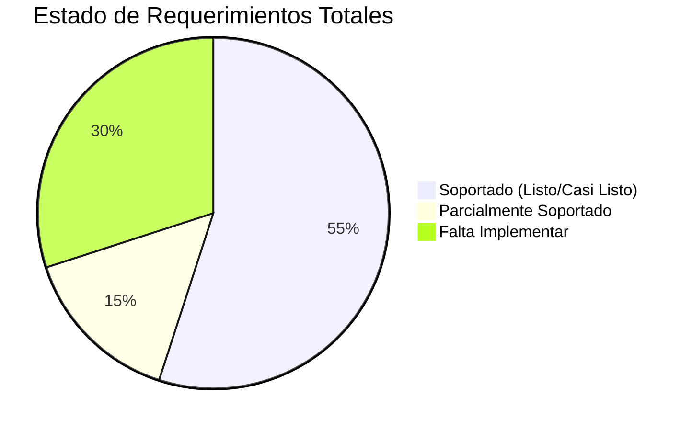

# 📊 Análisis de Cumplimiento de Requerimientos vs. Estado Actual (ServiTrack)

Este documento compara las especificaciones y el diseño funcional del arquitecto con el estado actual del desarrollo de la aplicación **ServiTrack**. Su propósito es identificar el porcentaje de cobertura y establecer qué componentes deben ser desarrollados o adaptados.

---

## 📈 Resumen General de Cobertura

---

## 🔍 Matriz de Comparativa Detallada

A continuación, se presenta la matriz de requerimientos con su estado actual de cumplimiento:

| Módulo / Requerimiento           |   Estado    | Detalle en el Sistema Actual                                                                                  | ¿Qué falta para cumplir al 100%?                                                                              |
| :------------------------------- | :---------: | :------------------------------------------------------------------------------------------------------------ | :------------------------------------------------------------------------------------------------------------ |
| **Acceso y Autenticación**       | **CUMPLE**  | Implementado con Supabase Auth. Cuenta con login, registro y recuperación de clave.                           | Ninguno. Listo para producción.                                                                               |
| **Gestión de Servicios Básicos** | **CUMPLE**  | Alta de servicios con empresa, monto, número de cliente, estado (pagado/pendiente), día de medición y cierre. | Agregar campo para adjuntar archivo/URL del comprobante.                                                      |
| **Gestión de Ingresos**          | **PARCIAL** | Permite registrar ingresos por monto y origen de forma mensual, con edición e historial básico.               | Agregar categorías específicas (Sueldo, Ventas, Alquileres) y relacionarlas con la base de datos.             |
| **Gestión de Egresos (Gastos)**  |  **FALTA**  | Solo permite registrar egresos conceptualizados como "servicios" o "préstamos".                               | Crear formulario de Gastos Diarios con categorías fijas (Super, Combustible, Ropa, Ocio) y método de pago.    |
| **Dashboard Financiero**         | **PARCIAL** | Muestra balance del mes, ingresos, egresos, liquidez disponible, servicios pagados y pendientes.              | Mostrar el listado de vencimientos de forma ordenada por fecha y la distribución de gastos por categorías.    |
| **Recordatorios / Alertas**      |  **FALTA**  | No cuenta con lógica de alertas activas por fechas de vencimiento.                                            | Implementar alertas visuales en la interfaz (Banner/Card) y notificaciones de correo mediante Edge Functions. |
| **Módulo de Presupuestos**       |  **FALTA**  | No existe la posibilidad de fijar límites por categorías.                                                     | Agregar la tabla de límites en Supabase, y pintar barras de progreso de consumo en el Dashboard.              |
| **Objetivos de Ahorro**          |  **FALTA**  | Solo tiene simulador de ahorro temporal en modal (Simulación Greedy).                                         | Crear panel para fijar metas estables (Auto, Vacaciones, Fondo) con aportes acumulados e indicadores.         |
| **Reportes y Gráficos**          | **PARCIAL** | Gráfico de barra apilada anual, gráfico estacional de consumo físico y exportación formateada a Excel.        | Agregar la generación y exportación directa de reportes a PDF y comparativas anuales/mensuales cruzadas.      |
| **Historial y Auditoría**        | **PARCIAL** | Filtro de historial mes a mes guardado en base de datos.                                                      | Crear un buscador global de transacciones que permita filtrar sin importar el mes seleccionado.               |

---

## 📋 Detalle Técnico por Área

### 🟢 1. Lo que ya está Listo (Completamente Funcional)

- **Seguridad y Sesión:** El componente `AuthComponent.js` y el ruteo dinámico en `page.js` validan las credenciales del usuario con Supabase. Las políticas RLS protegen los datos de accesos no autorizados.
- **Gestión Inteligente de Servicios:** `ServiceForm.js` autodetecta el tipo de servicio por su nombre e incluye campos especializados (ej. si el usuario escribe "Luz", habilita la medición de kWh).
- **Exportación de Datos:** El motor `excelHelper.js` genera hojas de cálculo corporativas estilizadas con fórmulas de balance automáticas listas para descargar.
- **Simulador Financiero:** `SimulationModal.js` calcula mediante un algoritmo codicioso (_Greedy_) qué gastos pendientes puedes saldar si recortas servicios.

### 🟡 2. Lo que Requiere Adaptación (Parcial)

- **Evolución del Dashboard:** Se deben integrar widgets de distribución de gastos (Gráfico de Torta / Doughnut) utilizando el instalador de `Chart.js` que ya posee la aplicación.
- **Modelo de Ingresos:** El tipo de registro `income` del formulario debe vincularse a categorías dinámicas y permitir clasificar el tipo de ingreso para reportes de rentabilidad.

### 🔴 3. Lo que se debe Construir desde Cero (Pendiente)

- **Control de Gastos Diarios:** Reorganizar la base de datos para separar transacciones rápidas (ej: almuerzos, nafta) de servicios mensuales recurrentes.
- **Recordatorios Activos:** Configurar un proceso desatendido en el servidor o consultas por fechas en cliente para notificar vencimientos próximos (10, 5, 1 días y el mismo día).
- **Presupuestos y Ahorro:** Implementar las vistas y formularios para definir límites mensuales y registrar alcancías digitales para metas específicas.

---

> [!TIP]
> **Recomendación de Desarrollo:**
> Se sugiere iniciar la expansión del sistema creando las tablas de `categories` y `transactions` en la base de datos de Supabase, lo cual habilitará de inmediato la gestión de ingresos/egresos reales antes de proceder con el módulo de presupuestos y alertas.
