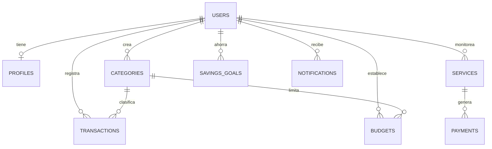
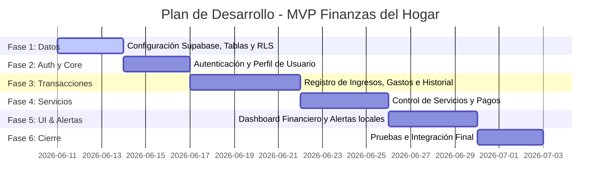

# 🛠️ Respuesta del Desarrollador: Plan de Implementación Técnica y Base de Datos

- **Rol:** Desarrollador Frontend/Fullstack (Next.js & Supabase)
- **Destinatario:** Arquitecto de Software y Analista Funcional
- **Referencia:** Requerimientos Funcionales y No Funcionales para el Sistema de Finanzas y Servicios del Hogar

---

## 📋 Introducción y Validación Técnica

Estimado Arquitecto, he analizado en detalle la especificación del sistema de gestión financiera y control de servicios del hogar. La propuesta funcional es sólida y el enfoque de un **Producto Mínimo Viable (MVP)** es ideal para asegurar un despliegue ágil y de alta calidad.

Aprovechando la pila tecnológica actual de la aplicación (**Next.js 14 (React 18), Supabase (Auth, DB y Storage) y Tailwind CSS**), podemos construir el MVP y escalar progresivamente a las siguientes etapas sin necesidad de reescribir la base del sistema.

A continuación, presento la propuesta de arquitectura técnica, el diseño del modelo de datos relacional en Supabase, el mapeo de componentes y la estrategia de mitigación para los desafíos técnicos identificados.

---

## 🗄️ 1. Diseño del Modelo de Datos (Esquema SQL en Supabase)

Para soportar las entidades sugeridas (`Usuario`, `Ingreso`, `Egreso`, `Categoría`, `Servicio`, `Pago`, `Presupuesto`, `Objetivo de ahorro`, `Notificación`, `Comprobante`), estructuraremos una base de datos relacional optimizada.

Implementaremos **Políticas de Seguridad a Nivel de Fila (RLS)** para garantizar que cada usuario solo acceda a su propia información.



### 💻 Scripts de Creación DDL (PostgreSQL)

> [!NOTE]
> Estos scripts se ejecutarán en el Editor SQL de Supabase. La tabla `profiles` se sincroniza automáticamente mediante un _trigger_ con la tabla nativa de autenticación `auth.users`.

```sql
-- 1. PERFILES DE USUARIO
create table public.profiles (
  id uuid references auth.users on delete cascade primary key,
  updated_at timestamp with time zone,
  full_name text,
  avatar_url text,
  email text
);

-- 2. CATEGORÍAS (Para Ingresos y Egresos)
create table public.categories (
  id uuid default gen_random_uuid() primary key,
  user_id uuid references auth.users(id) on delete cascade default auth.uid(),
  name text not null,
  type text not null check (type in ('income', 'expense')),
  icon text, -- Nombre de icono Lucide/Emoji
  color text, -- Código hexadecimal para la interfaz
  is_default boolean default false,
  created_at timestamp with time zone default timezone('utc'::text, now()) not null
);

-- 3. TRANSACCIONES (Ingresos y Egresos)
create table public.transactions (
  id uuid default gen_random_uuid() primary key,
  user_id uuid references auth.users(id) on delete cascade default auth.uid(),
  category_id uuid references public.categories(id) on delete set null,
  type text not null check (type in ('income', 'expense')),
  amount numeric(12,2) not null check (amount > 0),
  description text,
  payment_method text not null check (payment_method in ('efectivo', 'debito', 'credito', 'transferencia', 'billetera_virtual')),
  transaction_date date not null default current_date,
  created_at timestamp with time zone default timezone('utc'::text, now()) not null
);

-- 4. SERVICIOS BÁSICOS
create table public.services (
  id uuid default gen_random_uuid() primary key,
  user_id uuid references auth.users(id) on delete cascade default auth.uid(),
  company_name text not null,
  client_number text,
  service_type text not null check (service_type in ('luz', 'agua', 'gas', 'internet', 'telefono', 'cable', 'tasas_municipales', 'expensas', 'otros')),
  due_date date not null,
  status text not null default 'pendiente' check (status in ('pendiente', 'pagado', 'vencido')),
  amount numeric(12,2) not null check (amount >= 0),
  created_at timestamp with time zone default timezone('utc'::text, now()) not null
);

-- 5. PAGOS DE SERVICIOS (Historial de comprobantes y fechas)
create table public.payments (
  id uuid default gen_random_uuid() primary key,
  user_id uuid references auth.users(id) on delete cascade default auth.uid(),
  service_id uuid references public.services(id) on delete cascade,
  payment_date date not null default current_date,
  amount_paid numeric(12,2) not null check (amount_paid > 0),
  payment_method text not null,
  receipt_url text, -- Enlace al archivo guardado en Supabase Storage
  created_at timestamp with time zone default timezone('utc'::text, now()) not null
);

-- 6. PRESUPUESTOS (Límites de gastos por categoría)
create table public.budgets (
  id uuid default gen_random_uuid() primary key,
  user_id uuid references auth.users(id) on delete cascade default auth.uid(),
  category_id uuid references public.categories(id) on delete cascade,
  limit_amount numeric(12,2) not null check (limit_amount > 0),
  month integer not null check (month >= 1 and month <= 12),
  year integer not null,
  created_at timestamp with time zone default timezone('utc'::text, now()) not null,
  unique (user_id, category_id, month, year)
);

-- 7. METAS DE AHORRO
create table public.savings_goals (
  id uuid default gen_random_uuid() primary key,
  user_id uuid references auth.users(id) on delete cascade default auth.uid(),
  name text not null,
  target_amount numeric(12,2) not null check (target_amount > 0),
  current_amount numeric(12,2) not null default 0.00 check (current_amount >= 0),
  deadline date,
  is_completed boolean default false,
  created_at timestamp with time zone default timezone('utc'::text, now()) not null
);

-- 8. NOTIFICACIONES / RECORDATORIOS
create table public.notifications (
  id uuid default gen_random_uuid() primary key,
  user_id uuid references auth.users(id) on delete cascade default auth.uid(),
  title text not null,
  message text not null,
  is_read boolean default false,
  scheduled_for timestamp with time zone not null,
  sent_at timestamp with time zone,
  created_at timestamp with time zone default timezone('utc'::text, now()) not null
);
```

---

## 🛠️ 2. Mapeo de Módulos y Arquitectura de Frontend (Next.js)

Para cumplir con la interfaz intuitiva y moderna (usando el actual diseño **Glassmorphic**), dividiremos la interfaz en los siguientes componentes modulares:

### 🗂️ Componentes Propuestos

1.  **Dashboard Principal (`Dashboard.js`):**
    - **KPI Cards:** Balance General (Ingresos - Gastos), Liquidez, Total Pendiente de Servicios, Progreso de Ahorros.
    - **Accesos Rápidos:** Botones flotantes para "Registrar Ingreso/Gasto" y "Pagar Servicio".
    - **Lista de Vencimientos Inminentes:** Alertas visuales con código de colores según días restantes.
2.  **Gestión de Transacciones (`TransactionModal.js`):**
    - Formulario unificado con pestañas (Ingreso / Egreso).
    - Campos: Categoría (dropdown visual con iconos), Monto, Fecha, Método de Pago y Notas.
3.  **Gestor de Servicios Básicos (`ServiceList.js` & `ServiceForm.js`):**
    - Muestra de tarjetas de servicios agrupados por estado (`Pendiente` / `Pagado`).
    - Acción de "Pagar": Abre un modal para subir el comprobante de pago (arrastrar y soltar archivo) e ingresar la fecha de pago real.
4.  **Módulo de Presupuestos y Metas (`BudgetPlanner.js`):**
    - Visualización de barras de progreso (Consumido vs. Límite de Presupuesto).
    - Tarjetas dinámicas para metas de ahorro con porcentajes de completitud animados.
5.  **Reportes Visuales (`FinanceReports.js`):**
    - Uso de `Chart.js` para diagramas de pastel (distribución de gastos) e histogramas comparativos mensuales.

---

## ⚠️ 3. Desafíos Técnicos e Implementación de Recordatorios

El requerimiento de avisos programados (10, 5, 1 días antes y el mismo día) presenta un desafío técnico interesante en una arquitectura serverless basada en Next.js estático o SPA.

### 💡 Estrategia de Solución para Alertas y Recordatorios

Propongo un enfoque híbrido de tres niveles:

1.  **Alertas In-App (Bajo Costo & Eficiente):**
    Al iniciar sesión o cargar el Dashboard en el frontend, se ejecuta una función en JavaScript que compara la fecha actual con la fecha de vencimiento (`due_date`) de los servicios pendientes. Si se encuentran coincidencias en los rangos (10, 5, 1 días), se inyecta dinámicamente un banner de alerta destacado en el panel.
2.  **Notificaciones por Correo Electrónico (Automatizado - Supabase Edge Functions):**
    - Utilizaremos **Supabase Edge Functions** (código Deno Serverless) integradas con un servicio de correo transaccional gratuito (como _Resend_ o _SendGrid_).
    - Se programa una tarea cron diaria (usando extensiones de Supabase como `pg_cron` o plataformas de automatización cron externas como _GitHub Actions_ o _Vercel Cron_) para disparar una función que busque los servicios próximos a vencer y envíe un correo automatizado al email del usuario (`profile.email`).
3.  **Almacenamiento de Comprobantes:**
    Los archivos de facturas y recibos de pago se subirán a un bucket público/privado de **Supabase Storage** (`receipts`). El enlace resultante (`receipt_url`) se almacenará en la tabla `payments` para consultas de auditoría rápidas desde la interfaz.

---

## 🧭 4. Hoja de Ruta del Desarrollo (Roadmap de Lanzamiento)

Siguiendo su propuesta de MVP, sugiero dividir el desarrollo en sprints de 1 semana:



### 📋 Próximos Pasos Recomendados:

1.  **Aprobación del Esquema:** Validar que los campos propuestos en la tabla de base de datos cubran todas las necesidades de su análisis.
2.  **Configuración del Entorno:** Creación de las nuevas tablas en el panel de control de Supabase.
3.  **Maquetación de Formularios:** Crear los componentes del frontend respetando la estética Glassmorphic.

_Quedo a su disposición para realizar ajustes en el modelo relacional o en las prioridades de desarrollo antes de iniciar con la codificación de las tablas._
